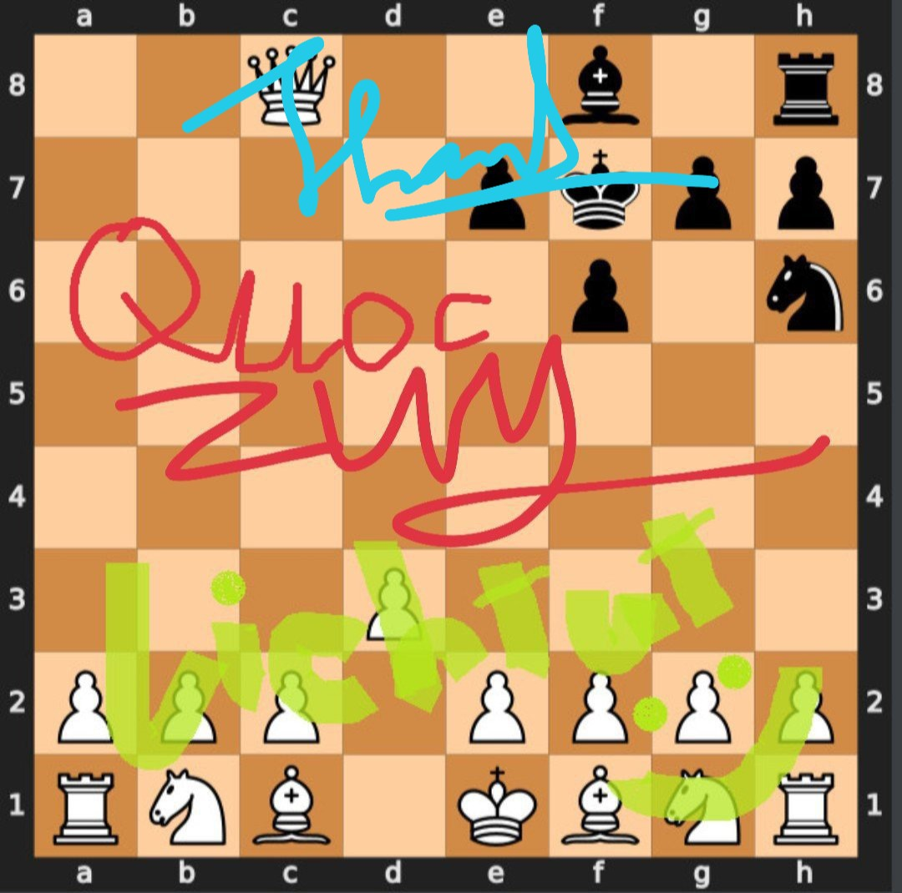

<!-- PROJECT LOGO -->
 

  
  
  <h3 align="center">CHESS AI with Alpha-Beta Pruning</h3>

<!-- TABLE OF CONTENTS -->

  
Table of Contents

  <ol>
    <li>
      <a href="#about-the-project">About The Project</a>
      <ul>
        <li><a href="#built-with">Built With</a></li>
      </ul>
    </li>
    <li>
      <a href="#getting-started">Getting Started</a>
      <ul>
        <li><a href="#prerequisites">Prerequisites</a></li>
        <li><a href="#installation">Installation</a></li>
      </ul>
    </li>
    <li><a href="#usage">Usage</a></li>
    <li><a href="#roadmap">Roadmap</a></li>
    <li><a href="#contributing">Contributing</a></li>
    <li><a href="#license">License</a></li>
    <li><a href="#contact">Contact</a></li>
    <li><a href="#acknowledgments">Acknowledgments</a></li>
  </ol>

<!-- ABOUT THE PROJECT -->
## About The Project

[![Product Name Screen Shot][product-screenshot]](https://github.com/lehieulol/Chess_AI-Intro_to_AI)

(<a href="#readme-top">back to top</a>)

### Libraries used

This is the list of all module used and how to install them

* [![WxPython][wxpython]][wx-url]
* [![chess][chess-python]][chess-url]
* [![Svglib][svglib]][svglib-url]
* [![ReportLab][reportlab]][reportlab-url]

(<a href="#readme-top">back to top</a>)

<!-- GETTING STARTED -->
## Getting Started

### Prerequisites

All module above already installed.

### Installation

1. Download this project
2. Make a new Pycharm or other IDE's project
3. Add each folders/files to your project
4. Run UI/main.py

(<a href="#readme-top">back to top</a>)

<!-- USAGE EXAMPLES -->
## Usage

(<a href="#readme-top">back to top</a>)

<!-- CONTACT -->
## Contact

Lê Quang Hiếu - [Hiếu Light](https://www.facebook.com/quanghieesu.lee) - hieu.lq210335@sis.hust.edu.vn

Project Link: [https://github.com/your_username/repo_name](https://github.com/your_username/repo_name)

(<a href="#readme-top">back to top</a>)

<!-- ACKNOWLEDGMENTS -->
## Acknowledgments

Use this space to list resources you find helpful and would like to give credit to. I've included a few of my favorites to kick things off!

* [Choose an Open Source License](https://choosealicense.com)
* [GitHub Emoji Cheat Sheet](https://www.webpagefx.com/tools/emoji-cheat-sheet)
* [Malven's Flexbox Cheatsheet](https://flexbox.malven.co/)
* [Malven's Grid Cheatsheet](https://grid.malven.co/)
* [Img Shields](https://shields.io)
* [GitHub Pages](https://pages.github.com)
* [Font Awesome](https://fontawesome.com)
* [React Icons](https://react-icons.github.io/react-icons/search)

(<a href="#readme-top">back to top</a>)

<!-- MARKDOWN LINKS & IMAGES -->
<!-- https://www.markdownguide.org/basic-syntax/#reference-style-links -->
[product-screenshot]: images/screenshot.png
[chess-python]: https://img.shields.io/badge/-chess--python-green
[chess-url]: https://pypi.org/project/chess/
[wxpython]: https://img.shields.io/badge/-WxPython-orange
[wx-url]: https://wxpython.org/pages/downloads/index.html
[reportlab]: https://img.shields.io/badge/-ReportLab-yellowgreen
[reportlab-url]: https://pypi.org/project/reportlab/
[svglib]: https://img.shields.io/badge/-SVGlib-yellowgreen
[svglib-url]: https://pypi.org/project/svglib/
